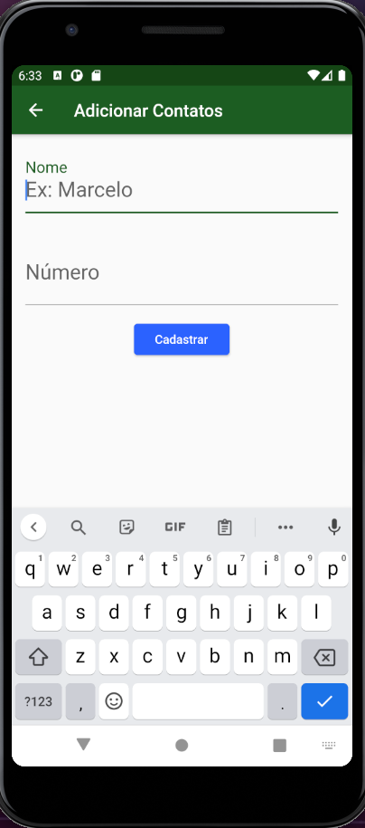

# project_bloc

## General Info

This project is a starting point for a Flutter application. The objective is learn Flutter and try to apply BLoC pattern in a simple application. Beside this, I tried to implement route manager, because this application can be upgraded in the future.

## Tecnologies

`Flutter 1.22.2`
`Dart 2.10.2`
`Firebase (cloud_firestore: ^0.14.1+3)`

## Illustrations

**The application has just two screens. Homepage has the list of contacts that you added on firebase:**

**And if you click to add another contact, will open this Create Contact screen:**

## Getting Started

For help getting started with Flutter, view our
[online documentation](https://flutter.dev/docs), which offers tutorials,
samples, guidance on mobile development, and a full API reference.
